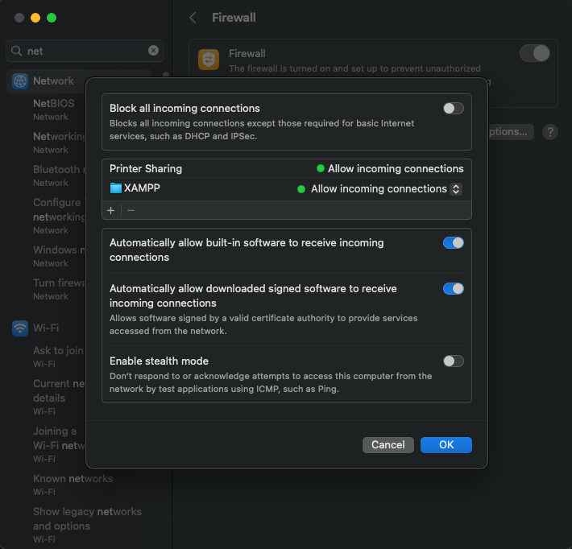

# NeuroTune – AI Music Discovery & Rating App

## Team Members
- Felix Berliner
- Will Drake
- Marouan El-Asery

## Project Overview
This project started as a landing page for **Homework 1 in COMP 333**. For **Homework 2**, it has been expanded into a full-stack **CRUD web application** with user authentication and a **MySQL database**.

### Features
- **User Authentication**: Register, log in, and log out securely
- **CRUD Operations**: Add, view, update, and delete song ratings
- **MySQL Database**: Stores user credentials and song ratings

Each team member contributed **equally (33.33%)** to the project.

## Functionality

### **User Authentication**
- Registration and login system
- Passwords are **hashed** and stored securely
- Users remain logged in via PHP sessions
- Duplicate usernames are not allowed

### **CRUD Music Rating System**
- Users can **add a song rating** (title, artist, rating)
- Users can **view all song ratings** in the database
- Users can **edit and delete their own ratings**
- Users **cannot edit or delete ratings added by others**

### **Database Integration**
- Two tables:
  - `login` (stores usernames and hashed passwords)
  - `ratings` (stores song ratings with a foreign key to `login`)

### **Security Measures**
- **Passwords are hashed** 
- **SQL queries are parameterized** to prevent SQL injection
- **Session management** ensures authentication security
- **Form validation** prevents incorrect input

---

## Installation Guide

### Setup XAMPP (Local Development)**
1. Download and install **XAMPP** from [Apache Friends](https://www.apachefriends.org/)
2. Start **Apache** and **MySQL** from the XAMPP Control Panel
3. Place all project files inside the `htdocs/` folder into XAMPP's htdocs folder (except for the tests folder)

### **2. Create the MySQL Database (Local)**
1. Open phpMyAdmin (`http://localhost/phpmyadmin`)
2. Run the following SQL commands:

```sql
CREATE DATABASE app_db;

USE app_db;

CREATE TABLE login (
    username VARCHAR(255) PRIMARY KEY,
    password VARCHAR(255) NOT NULL
);

CREATE TABLE ratings (
    id INT AUTO_INCREMENT PRIMARY KEY,
    username VARCHAR(255),
    song VARCHAR(255) NOT NULL,
    artist VARCHAR(255) NOT NULL,
    rating INT NOT NULL CHECK (rating BETWEEN 0 AND 9),
    FOREIGN KEY (username) REFERENCES login(username) ON DELETE CASCADE
);


CREATE TABLE songdata (
  id INT AUTO_INCREMENT PRIMARY KEY,
  song VARCHAR(255) NOT NULL,
  artist VARCHAR(255) NOT NULL,
  lyrics VARCHAR(4080) NOT NULL
);

CREATE TABLE lyricsimilarity (
  song1 VARCHAR(255),
  artist1 VARCHAR(255),
  song2 VARCHAR(255),
  artist2 VARCHAR(255),
  similarity INT(3)
);

CREATE TABLE `emotions` (
  `id` INT AUTO_INCREMENT PRIMARY KEY,
  `user` varchar(30) NOT NULL,
  `song` varchar(255) NOT NULL,
  `artist` varchar(255) NOT NULL,
  `sad` tinyint(1) NOT NULL,
  `happy` tinyint(1) NOT NULL,
  `excited` tinyint(1) NOT NULL,
  `fear` tinyint(1) NOT NULL,
  `anger` tinyint(1) NOT NULL,
  `nostalgia` tinyint(1) NOT NULL
);
```

### Configure Database Connection**
Modify `connection.php` to match local database credentials:

```php
$servername = "localhost";
$username = "root";
$password = "";
$db_name = "app_db";

$conn = new mysqli($servername, $username, $password, $db_name);

if ($conn->connect_error) {
    die("Connection failed: " . $conn->connect_error);
}
?>
```
# Backend REST API & XAMPP Setup (Local Access + Remote Testing)

## Apache Configuration (Remote Access Enabled)

To allow external devices (React Native or Postman) to connect to your local Apache server, follow these steps:

### 1. Edit Apache Config File (httpd.conf)
Located at:
```
/Applications/XAMPP/xamppfiles/etc/httpd.conf
```

Make the following changes:

```apacheconf
<Directory />
    AllowOverride All
    Require all granted
</Directory>

<Directory "/Applications/XAMPP/xamppfiles/htdocs">
    Options Indexes FollowSymLinks ExecCGI Includes
    AllowOverride All
    Require all granted
</Directory>
```

This allows public access to your API endpoints (safe for development use only).

### 2. Expose Port 80 on macOS
- Go to **System Settings > Network > Firewall > Options**
- Ensure that **XAMPP** or **Apache HTTP Server** is set to **"Allow incoming connections"**


## Enable CORS for Cross-Origin Requests

Update `BaseController.php` to include the following in `sendOutput()`:

```php
protected function sendOutput($data, $httpHeaders = [])
{
    header("Access-Control-Allow-Origin: *");
    header("Access-Control-Allow-Methods: GET, POST, PUT, DELETE, OPTIONS");
    header("Access-Control-Allow-Headers: Content-Type, Authorization");

    header_remove('Set-Cookie');
    if (is_array($httpHeaders)) {
        foreach ($httpHeaders as $httpHeader) {
            header($httpHeader);
        }
    }

    echo $data;
    exit;
}
```

## Handle Preflight Requests (OPTIONS)

In `index.php`, add this **before routing logic**:

```php
if ($_SERVER['REQUEST_METHOD'] === 'OPTIONS') {
    header("Access-Control-Allow-Origin: *");
    header("Access-Control-Allow-Methods: GET, POST, PUT, DELETE, OPTIONS");
    header("Access-Control-Allow-Headers: Content-Type, Authorization");
    exit(0);
}
```

## API Testing via Postman (Live Backend)

Once the server is configured and running at your machine's IP (e.g. `129.133.73.252`):

### Test User Registration:
- **POST** `http://129.133.73.252/index.php/user/register`
```json
{
  "username": "testuser",
  "password": "strongpassword123",
  "confirm_password": "strongpassword123"
}
```

### Test User Login:
- **POST** `http://129.133.73.252/index.php/user/login`
```json
{
  "username": "testuser",
  "password": "strongpassword123"
}
```

### Add Song Rating:
- **POST** `http://129.133.73.252/index.php/rating/create`
```json
{
  "username": "testuser",
  "song": "Bohemian Rhapsody",
  "artist": "Queen",
  "rating": 9
}
```

### View All Ratings:
- **GET** `http://129.133.73.252/index.php/rating/list`

These all return valid JSON responses if configured correctly.

## Local Database (`app_db`)
Use this SQL in phpMyAdmin:

```sql
CREATE DATABASE app_db;

USE app_db;

CREATE TABLE login (
    username VARCHAR(255) PRIMARY KEY,
    password VARCHAR(255) NOT NULL
);

CREATE TABLE ratings (
    id INT AUTO_INCREMENT PRIMARY KEY,
    username VARCHAR(255),
    song VARCHAR(255) NOT NULL,
    artist VARCHAR(255) NOT NULL,
    rating INT NOT NULL CHECK (rating BETWEEN 0 AND 9),
    FOREIGN KEY (username) REFERENCES login(username) ON DELETE CASCADE
);
```
## React Setup Instructions
Create a new expo project with `npx create-expo-app <your app name>`.
Then, copy the following files from the github to your project:
- NeuroTuneFrontend/constants/api.js into your project's constants folder
- Place the context folder into the folder for the entire project (alongside app, constants, etc.)
- Place NeuroTuneFrontend/app/_layout.jsx into the project's app folder
- Place the NeuroTuneFrontend/app/(app) and NeuroTuneFrontend/app/(auth) folders into your project's app folder

Finally, there are two remaining steps to set up the project:
- Delete the _layout.tsx file in your project's app folder
- Edit api.js (should be in the constants folder) and change the base url to contain your computer's ip adress and your XAMPP port.

From there, you should be okay to cd into your folder from your command prompt and start expo like usual.

## Postman Photos

### Will: 

GET:


POST:


### Felix:


## PHP Unit Tests
Create a folder in your computer's version of htdocs to hold the unit tests, and inside that folder install phpunit and guzzle (using the same instructions from Professor Zimmeck's tutorial). Then, place the StackTest.php file from the htdocs/tests folder into your unit test folder. Then in the command line, cd to your folder and run the unit test using the following command:

.\vendor\bin\phpunit StackTest.php

(Note: This command is for Windows's command prompt, adjust the syntax for your OS accordingly.)

## How can Generative AI be used to test the app?
In addition to coming up with tests for the code, another way AI could be used is to test for things that don't necessarily have a provably correct or incorrect answer. For example, our feature for the project is a song suggestion algorithm, but the question of is most "similar" to another isn't something objective that can be determined to be working correctly or incorrectly with regular tests. However, an AI model that can come up with an estimate of which songs should be judged as similar can then create tests that determine the accuracy of the program's algorithm. That way, a song suggestion algorithm can be deemed accurate / inaccurate even if there aren't necessarily any bugs in the code.

## New Features for Project
Our new feature that we added to our ratings app was a suggestion algorithm. On the profile page (previously the logout page), the user can request that the app suggest a song to them based off of their ratings. The algorithm is made up of three components, each of which are combined to give a score to each song that hasn't been personally rated by the logged in user, and then suggests the highest scoring song to the user. These components are:
- lyric similarity, which uses an api call to an ai model to determine the similarity of two song's lyrics, and gives a score based off of how similar they are.
- Other user's ratings, which lets a user input up to three other users whose opinions they often agree with / find valuable and gives a score based off of those user's ratings. The score is either based off of similarity in rating or just how high the rating is, depending on the user's choice.
- Emotional similarity, which gives a score to a song candidate based off of how similar the emotional responses to the songs are to the user's rated songs. The emotional responses are sourced by another small feature that was added, which lets users note their emotional response to particular songs on the 'read' tab by pressing a button. Each user can pick one emotion per song/artist combination, and the emotional makeup of a song is determined by the percentage of how each user voted on the song.
What makes our feature unique compared to other song suggestion algorithms is that we strived to give the user lots of choices in how to customize the algorithm to their liking. This includes letting them determine how much each component is weighed in the algorithm, picking which ratings to base the suggestions off of, whether to give each rating a flat weight or to weight higher rated songs better, and many other options. Therefore, our app's algorithm both allows for much more user choice than other algorithms would, but also gives them more transparency in knowing what parts of the algorithm are suggesting a song to them.
